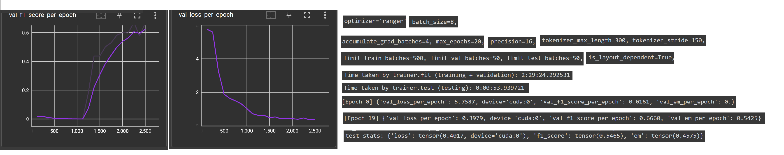
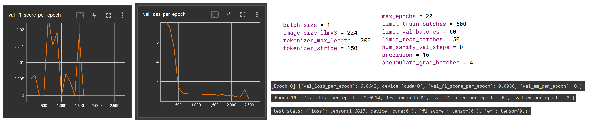

# Visual SQuAD Long document QA: Page-text, Page-image 

**What work has been done?**

Colab training:

- RoBERTa:

- LLMv3: OutOfMemoryError for even batch_size=2
 

**How to run the code?**

*Locally: By scraping data*

- Download SQuAD2.0 dataset from https://rajpurkar.github.io/SQuAD-explorer/  and place the files as src\data\squad\dev-v2.0.json, src\data\squad\train-v2.0.json.
- Update WKHTMLTOPDF_PATH in src\data_preprocessing\squad\preprocess_squad.py after installing wkhtmltopdf from https://wkhtmltopdf.org/downloads.html 
- Install requirements in a python 3.9 environment. For CPU-based computing, use src\requirements_cpu.txt. For GPU-based computing, first install pytorch 2.0.1 and then install src\requirements_minus_torch.txt.
- [Optional]: Configure project settings by editing src\parameter.ini file
- **Run src\main.py which saves visual data in outputs\squad directory, loads it into train-dev-test dataloaders and trains respective model specified in parameter.ini, and tests the best model produced.**

*Locally: By downloading data as zip*

- Download visual squad data from https://drive.google.com/file/d/18fveFPRmtj6Q6qQyNHOehtcWXXvqYzet/view?usp=drive_link
- Unzip 18_07_page_docs_data.zip at src\outputs\squad\18_07_page_docs_data location. Edit image paths in src\outputs\squad\18_07_page_docs_data\modelling_data.json according to the windows or linux environment you are using.
- Install requirements in a python 3.9 environment. For CPU-based computing, use src\requirements_cpu.txt. For GPU-based computing, first install pytorch 2.0.1 and then install src\requirements_minus_torch.txt.
- [Optional]: Configure project settings by editing src\parameter.ini file
- **Run src\main.py which saves visual data in outputs\squad directory, loads it into train-dev-test dataloaders and trains respective model specified in parameter.ini, and tests the best model produced.**

*Colab*

Shared directory: https://drive.google.com/drive/folders/10HR3cCtYaGcf7nk1DI5OAf3HNPJ18Lli?usp=sharing
- [Optional]: Configure project settings by editing src\parameter.ini file
- Open and run: src\run_MRC.ipynb

**What's new?**

- on_train_end() and on_validation_end() are now called in main.py rather than calling in models.py
- replaced with torchmetrics in get_all_scores() of models.py

*Enabling long docs*

- removed generate_para_images() call in src\data_preprocessing\squad\run_preprocess.py and its dependencies in src\data_preprocessing\squad\preprocess_squad.py
- generate_pdfs_images_bboxes() of src\data_preprocessing\squad\run_preprocess.py is edited so that it saves data as follows:
`visual_squad\
    <doc_id>\
        pdf.pdf,
        pages\
            <page_nr>\
                bboxes.json,
                image.png,
                text.txt`
the images are resized before saving - updated save_images_words_bboxes() of src\data_processing.py 
- create_preliminary_modelling_data is edited to offset para-based answer start, end char positions to adapt it too whole page
- is_layout_dependent added as param for setting roberta to use linebreaks info or not
- _to_token_positions() of src\dataloader.py offsets positions in tokenized sequence
- in decode_output() of src\models.py predicted answer is selected based on answer_confidence if answer is found in respective spans

**Ways to limit data:**

*In scraping*

Edit DOC_LIMIT variable in src\constants.py

*While loading data to dataloader*

After creating an instance of SquadDataset and getting dataloaders in src\main.py add this: `<instance>.dataset=<instance>.dataset[<doc_limit>]`

*In training*

Edit limit_train_batches, limit_val_batches, limit_test_batches in src\parameters.ini

**Possible Improvements:**
- adding more metrics BLEU, ANLS
- adding more models: XLM & LayoutXLM, BERT & VisualBERT
- automatically download and unzip original SQuAD 2.0 data
- filenames as constants
- alternative to wkhtmltopdf it needs us to specify its installation path while using it
- async scraping process with ip rotation