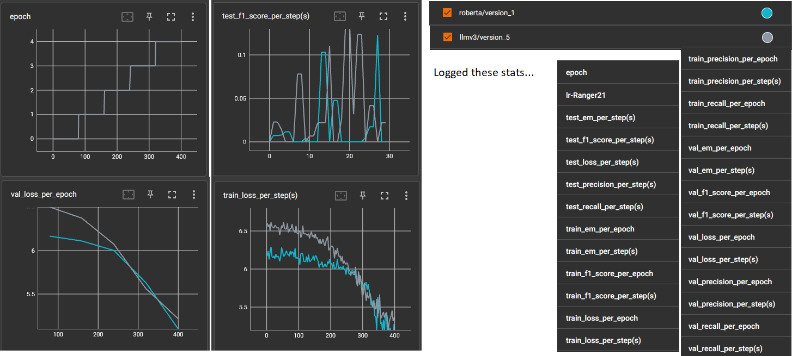

**What work has been done?**

Training over 80 training batches, 20 validation batches, 30 testing batches with batch_size=6 for 5 epochs produces following Tensorboard results:

**How to run the code?**

*Locally: By scraping data*

- Download SQuAD2.0 dataset from https://rajpurkar.github.io/SQuAD-explorer/  and place the files as src\data\squad\dev-v2.0.json, src\data\squad\train-v2.0.json.
- Update WKHTMLTOPDF_PATH in src\data_preprocessing\squad\preprocess_squad.py after installing wkhtmltopdf from https://wkhtmltopdf.org/downloads.html 
- Install requirements from src\requirements.txt
- [Optional]: Configure project settings by editing src\parameter.ini file
- **Run src\main.py which saves visual data in outputs\squad directory, loads it into train-dev-test dataloaders and trains respective model specified in parameter.ini, and tests the best model produced.**

*Locally: By downloading data as zip*

- Download visual squad data from https://drive.google.com/file/d/1JYFZ999nIv5TOnU3oeeYBe7FLjuE6CZg/view?usp=sharing
- Unzip data_29_06 at src\outputs\squad\processed_2017 location.
- Install requirements from src\requirements.txt in a python 3.9 environment.
- [Optional]: Configure project settings by editing src\parameter.ini file
- **Run src\main.py which saves visual data in outputs\squad directory, loads it into train-dev-test dataloaders and trains respective model specified in parameter.ini, and tests the best model produced.**

*Colab*

Shared directory: https://drive.google.com/drive/folders/10HR3cCtYaGcf7nk1DI5OAf3HNPJ18Lli?usp=sharing
- [Optional]: Configure project settings by editing src\parameter.ini file
- Open and run: src\run_MRC.ipynb

**What's new?**

- New file: src\models.py
- New file: src\ranger21.py
- added training and testing code in src\main.py
- added offset_start_end_positions function (çreated at src\data_processing.py) in src\data_preprocessing\squad\run_preprocess.py
- corrected how start_positions and end_postions are loaded in prepare_RoBERTa_examples, prepare_LLMv3_examples functions of src\dataloader.py

**Ways to limit data:**

*In scraping*

Edit DOC_LIMIT variable in src\constants.py

*While loading data to dataloader*

After creating an instance of SquadDataset and getting dataloaders in src\main.py add this: `<instance>.dataset=<instance>.dataset[<doc_limit>]`

*In training*

Edit limit_train_batches, limit_val_batches, limit_test_batches in src\parameters.ini

**Fixes to be made:**

*Marked these using comments starting with "FIXED LATER: "*
- medium priority: Out of 124052 questions, 2 questions are not properly offsetted (start and end positions). It is handled by try and except for now.
- low priority: Getting para images works for only scale_factor=1

**Improvements that will be done in "Run_experiments" PRs (low priority):**
- auto download of SQuAD 2.0 files
- generate_para_images_for_broken_para function in src\data_preprocessing\squad\preprocess_squad.py
- automatically download and unzip original SQuAD 2.0 data