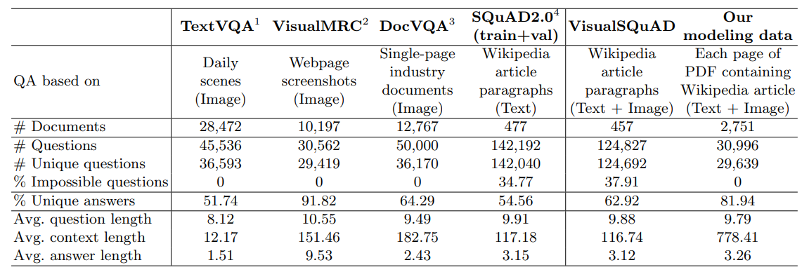

# Document Question-Answering on VisualSQuAD: Page-text, Page-image 

##  Abstract
In the domain of Document Question Answering (Document QA), text predominantly manifests in a unidirectional or linear manner, thus spotlighting the significance of question answering (QA) over such texts. Documents containing exclusively this form of text are termed ‘linear text documents’. These documents serve as pivotal resources for training models to answer questions on linear texts from any document. While both Visual Question Answering (VQA) and Textual Question Answering (Textual QA) models have the capability to perform QA over linear text documents, a critical inquiry arises: which model excels in this context? Such a comparison would be fair since both models can fully comprehend the texts from these documents. Past research has delved into comparing these models but not explicitly over linear texts. The lack of a dataset exclusively comprised of linear text documents has caused this limitation. In our present study, this gap is bridged by introducing a novel Document QA dataset, “VisualSQuAD”, meticulously curated to contain only linear text documents. Most importantly, using this new dataset, a fair comparison of these models is performed discerning their data efficiencies. Our findings illuminate how multi-modality influences learning across varying data regimes. On the other hand, the VisualSQuAD dataset, unlike existing VQA datasets, contains an expansive collection of questions and long documents, broadening its potential applications.

## VisualSQuAD vs other document VQA datasets
 

## How to run the code?

- Download SQuAD2.0 dataset from https://rajpurkar.github.io/SQuAD-explorer/  and place the files as src\data\squad\dev-v2.0.json, src\data\squad\train-v2.0.json.
- Update WKHTMLTOPDF_PATH in src\data_preprocessing\squad\preprocess_squad.py after installing wkhtmltopdf from https://wkhtmltopdf.org/downloads.html 
- Install requirements in a Python 3.9 environment. For CPU-based computing, use src\requirements_cpu.txt. For GPU-based computing, first, install Pytorch 2.0.1 and then install src\requirements_minus_torch.txt.
- [Optional]: Configure project settings by editing src\parameters.ini file
- **Run src\main.py which saves VisualSQuAD data in outputs\squad directory, loads it into train-dev-test dataloaders and trains respective model specified in parameter.ini, and tests the best model produced.**

## Ways to limit data

**In scraping:**

Edit DOC_LIMIT variable in src\constants.py

**While loading data to dataloader:**

After creating an instance of SquadDataset and getting dataloaders in src\main.py add this: `<instance>.dataset=<instance>.dataset[<doc_limit>]`

**In training:**

Edit limit_train_batches, limit_val_batches, limit_test_batches in src\parameters.ini

## Possible Improvements
- adding more metrics BLEU, ANLS
- adding more models: XLM & LayoutXLM, BERT & VisualBERT
- automatically download and unzip original SQuAD 2.0 data
- filenames as constants
- alternative to wkhtmltopdf it needs us to specify its installation path while using it
- async scraping process with ip rotation

*Repository note: The main code has been imported from a private repo. Hence, commits are made directly to the main branch.*
